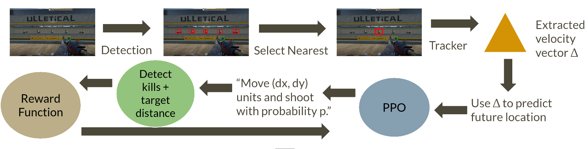

# Reinforcement Learning for 3D Aiming Control

[](LICENSE)
[](https://www.python.org/)

This repo contains my code and trained weights for a Reinforcement Learning agent that learns aiming mechanics using visual input and PPO.

The pipeline captures game frames, detects valid targets and uses PPO to learn the mouse movements required to move the crosshair towards them. On the community map *Aim Botz* it averages 93.6 ± 2.8 kills-per-minute (KPM) on stationary targets and 39.2 ± 1.7 KPM on moving targets. In my tests, this was roughly 2x faster than the human players I compared it against (Master Guardian I - Distinguished Master Guardian rank).

## Disclaimer

This project was developed and evaluated exclusively in the legacy version of Counter-Strike: Global Offensive (CS), using local matches against bots in a controlled environment.

It was not developed for Counter-Strike 2 and was never tested or used in public matchmaking or against human players. Legacy CS was intentionally chosen to keep all experiments isolated to a bot-only environment and outside the current public matchmaking ecosystem.

## Demo
<table>
  <tr>
    <td>Stationary Targets</td>
    <td>
      <video
        src="https://github.com/user-attachments/assets/207b4ef4-5e02-4a01-ab87-8caae496fee5"
        width="391"
        autoplay
        loop
        muted
        playsinline>
      </video>
    </td>
  </tr>
  <tr>
    <td>Moving Targets</td>
    <td>
      <video
        src="https://github.com/user-attachments/assets/9094ed74-faae-40fd-8afd-c779a00b3450"
        width="391"
        autoplay
        loop
        muted
        playsinline>
      </video>
    </td>
  </tr>
</table>


## Motivation

In a normal 2D interface (web browsers, for example), moving the mouse and moving the cursor are almost the same thing. If you move the mouse to the right, the cursor will also move to the right by a predictable amount. In a 3D game, however, the scene is rendered in three dimensions and then projected onto a 2D plane, with said projection being shaped by camera parameters such as horizontal/vertical FOV, focal distance, and aspect ratio (4:3, 16:9, 21:9, etc.). As a result, a target being 100 pixels away from the crosshair does not necessarily mean that moving the mouse by 100 units will place the crosshair on it. The mapping depends on the game's camera and input settings.

One way to solve this would be to explicitly model or calibrate the relationship between screen space distance and mouse movement. The problem is that this would require figuring out the camera and input settings used by each game, and some games may not even expose any of those settings at all. That could mean digging through configuration files, reverse engineering game behavior, or otherwise finding game-specific ways to recover the information needed for the mapping. Doing that for every possible configuration of every existing game would be pretty annoying.

This is, however, a pretty nice use case for Reinforcement Learning. Instead of explicitly deriving this mapping, an RL agent can learn it implicitly by interacting with the game. It moves the mouse, observes how the target moved relative to the crosshair, and uses that feedback to improve its next action.

This is the main idea behind my Reinforcement Learning agent, which is to use screen capture and targets inside Counter-Strike to learn the mapping between 2D screen-space target distance and the mouse movements required to aim at them. By training the agent with the appropriate reward function, the network can eventually learn to aim in Counter-Strike.


## Key Features
|  |  |
|------|---------------|
| **Flexible** | The same training idea can theoretically be adapted to any 3D environment |
| **Modern ML stack** | Uses Proximal Policy Optimization, lightweight Visual Transformers for tracking and real-time object detection models.
| **Vision-only pipeline** | Works from captured frames without needing access to the game's internal memory |
| **Optional ViT tracker** | Predicts target motion to compensate vision latency |
---


## 🏁 Quick Start

```bash
# 1) Clone
git clone https://github.com/rafa-diniz/Reinforcement-Learning-CSGO
cd Reinforcement-Learning-CSGO

# 2) Create a virtual env with python version 3.12.10 (You can get it here: https://www.python.org/downloads/release/python-31210/)
python -m venv myenv
# 3) Activate the env (my example uses CMD. Check if your terminal is using CMD or PowerShell)
myenv/Scripts/activate.bat

# 4) Install deps
pip install -r requirements.txt

# 5) Compile the tensorRT detection model
python exportengine.py

# 6) Run the agent on the Aim Botz training map
# If loading the trained weights, make sure to use the same game settings as me - the weights learned the screen-space -> mouse-movement mapping for my game settings; if you want to use different game settings, you'll have to train the agent from scratch. My settings: windowed, 1920×1080, FOV 90, mouse sentivity 1.0, mouse yaw and mouse pitch = 0.022, disable raw_input in mouse settings)
python main.py
```

## ⚙️ Design

The general architecture has two main components: A Computer Vision pipeline (Object Detection + OCR + an optional ViT Tracker), and a Proximal Policy Optimization (PPO) component. 



The Computer Vision component is responsible for extracting information from the environment, such as the positions of enemies, the velocity of a target and registering successful kills.

The reward function contains three components:

* The Distance Penalty term penalizes the agent for aiming the crosshair away from the target using $-\mu$. If the agent picks a movement large enough to lose the target, it receives a fixed -0.6 penalty instead.

* The Kill Bonus rewards the agent for getting kills.

* The View Angle Penalty penalizes the agent for aiming too high or too low and encourages it to look forward.

The full reward function is: 

$$
R =
\underbrace{
  \begin{cases}
    -\mu, & \text{if detection is valid and target was not lost by tracker} \\
    -0.6, & \text{if detection is valid and target was lost by tracker} \\
    0,    & \text{if detection is not valid}
  \end{cases}
}_{\text{Distance Penalty}}
;+;
\underbrace{2.0 \cdot (\text{Number of Kills})}_{\text{Kill Bonus}}
;+;
\underbrace{
  \begin{cases}
    -0.6,             & \text{if }abs(\text{Current Y}) > 0.85 \\ 
    0,                & \text{otherwise}
  \end{cases}
}_{\text{View Angle Penalty}}
$$
